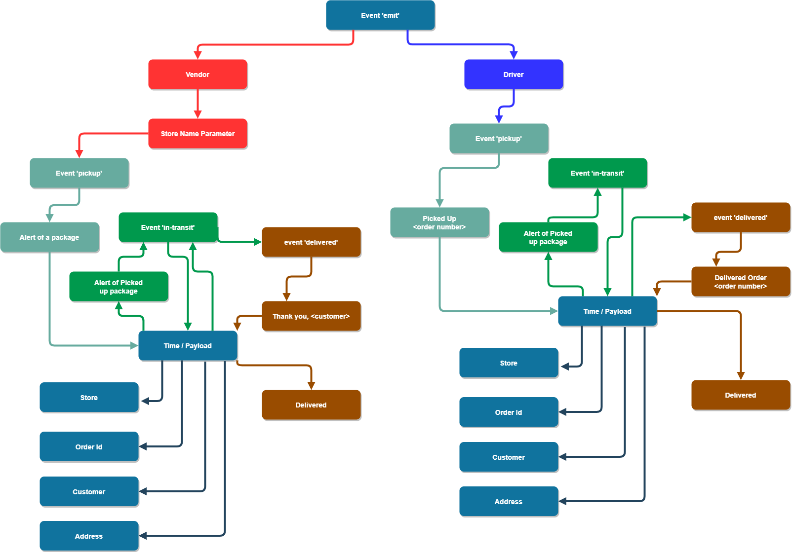

# The Code Academy Parcel Service

## Author

- Charlie Fadness

## Starting

Entering the command `npm run start` will start the server up. 

- We need our `hub.js` file to run
  - Then we need to have our `vendor.js`, `driver.js`, and `caps-api.js` to connect to our server and rooms as well as to see our console logs

## Tests

`npm run test` will run our tests

## About

We are creating a event driven program that sends out a event listener request. When we post something to our API, it will run **pickup**, **in-transit**, and/or **delivered** depending on what post request it gets. 

## UML

## Contributors

- Tom McGuire
- [Console SpyOn](https://stackoverflow.com/a/59225389)
- [Testing with Socket](https://socket.io/docs/v4/testing/)
